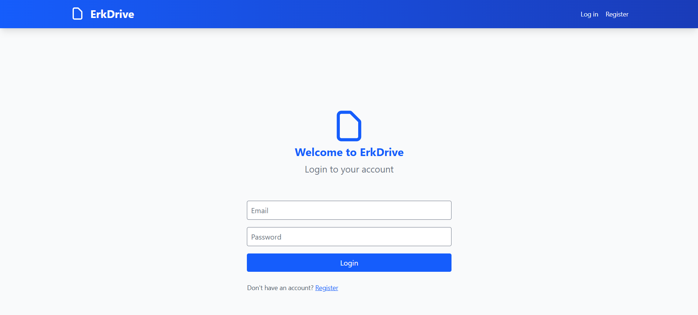
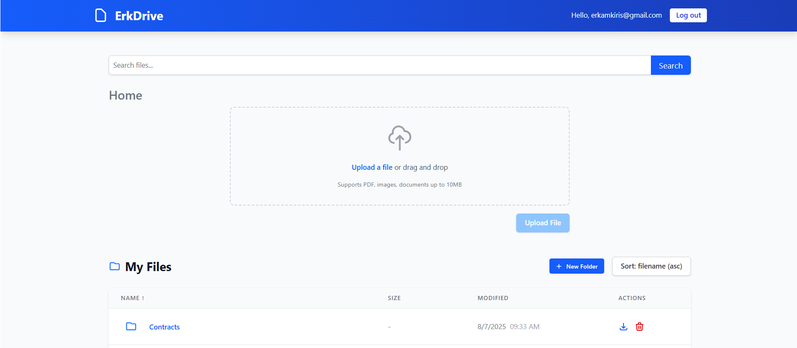
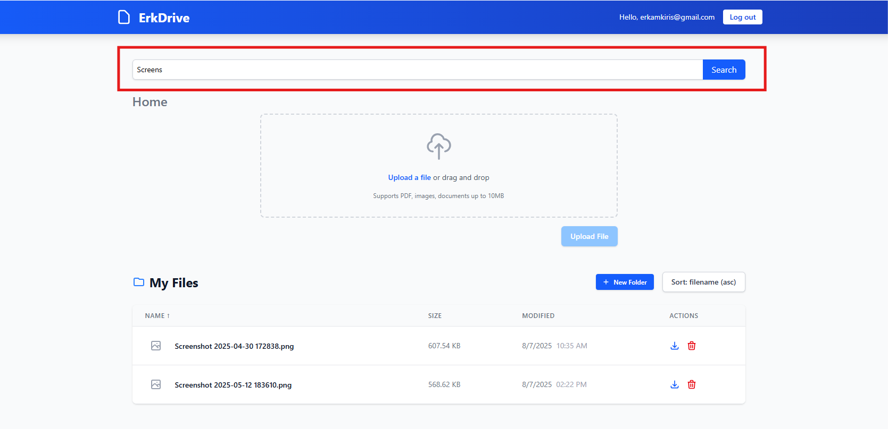
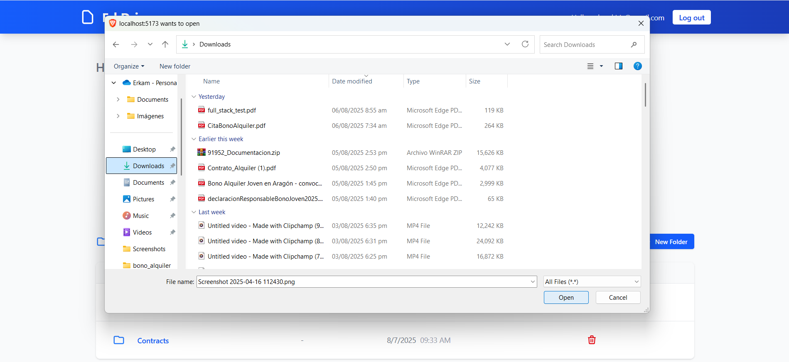

# 🗂️ ErkDrive – A Drive Clone with SvelteKit + FastAPI + MongoDB + MinIO

ErkDrive is a full-stack cloud storage application similar to Google Drive. It allows users to:

- ✅ Register and log in securely  
- 📁 Create folders and upload files  
- 📤 Drag & drop or browse for uploads  
- 🔒 Authenticated access using JWT  
- 📄 View files, download, and delete them  
- 🔗 Backend-powered by FastAPI and MinIO  
- 🌐 Frontend built with SvelteKit & Tailwind CSS  

<br>

## 🚀 Features

### 🔐 Login Page  
- **Authentication**
  - JWT-based secure login and token storage in SvelteKit stores
  - Route protection with redirect to `/login` if unauthenticated



### 📝 Register Page  
 - JWT-based secure register


### 📁 File Management  
  - Upload, browse, and download files
  - Supports folder creation and breadcrumb navigation
  - Displays file type, size, and upload time
  - Search the name of the file type in search-bar




### 📤 File Upload  
  - Drag-and-Drop Upload
  - File dropzone supports images, PDFs, documents
  - Real-time upload status with error/success indicators




- **Backend API**
  - RESTful endpoints for login, register, upload, folder management
  - MinIO used for file storage
  - MongoDB used for metadata and user accounts

---

## 🛠 Tech Stack

| Layer        | Tech |
|-------------|------|
| Frontend     | [SvelteKit](https://kit.svelte.dev/), [Tailwind CSS](https://tailwindcss.com/) |
| Backend      | [FastAPI](https://fastapi.tiangolo.com/), [MinIO](https://min.io/), [MongoDB](https://www.mongodb.com/) |
| Auth         | JWT (JSON Web Token) |
| Containerization | Docker & Docker Compose |

---

## 📦 Project Structure

```
├── frontend/                  # SvelteKit app
│   ├── src/
│   │   ├── lib/
│   │   │   └── components/    # FileBrowser, FileUpload, etc.
│   │   ├── routes/            # +page.svelte files
├── backend/                   # FastAPI app
│   └── app/
│       ├── main.py            # API endpoints
│       └── auth.py            # Auth logic (assumed)
├──  public/                # Static assets and screenshots
├── docker-compose.yml
└── README.md

```

---

## 🧪 Local Development

### 📋 Prerequisites

- Docker & Docker Compose
- Node.js and npm (for frontend dev outside Docker)

### 🔄 Clone the Repo

```bash
git clone https://github.com/erkamkrs/ErkDrive.git
cd ErkDrive
```

### 🐳 Start the Services

```bash
docker-compose up --build
```

- Frontend: [http://localhost:5173](http://localhost:5173)  
- Backend API: [http://localhost:8000](http://localhost:8000)  
- MinIO Console: [http://localhost:9001](http://localhost:9001)  
  - Access Key: `minioadmin`
  - Secret Key: `minioadmin`

---

## 🧪 API Endpoints

### 🔐 Authentication

- `POST /login` – login with email & password  
- `POST /register` – register a new user  

### 📁 Files

- `POST /upload?folder={id}` – upload a file  
- `GET /files?folder={id}` – list files in folder  
- `DELETE /files/{file_id}` – delete file  
- `GET /download/{file_id}` – download file  

### 📂 Folders

- `POST /folders?name=NewFolder` – create new folder  

---

## 🧱 Environment Variables

| Variable         | Description                    | Example            |
|------------------|--------------------------------|--------------------|
| `MONGO_URI`      | MongoDB connection URI         | `mongodb://mongo:27017` |
| `MINIO_ENDPOINT` | MinIO server endpoint          | `minio:9000`       |
| `MINIO_ACCESS_KEY` | MinIO access key             | `minioadmin`       |
| `MINIO_SECRET_KEY` | MinIO secret key             | `minioadmin`       |

These are set in the Docker Compose `backend` service via `.env` or directly in `docker-compose.yml`.

---

## 🧠 Auth Flow Summary

- On login or registration, user receives a JWT token
- The token is stored in a SvelteKit store
- All API calls requiring authentication use:

  ```http
  Authorization: Bearer <token>
  ```

- Protected routes (like `/`) check token presence and redirect to `/login` if missing

---

## 📂 Upload Flow Summary

1. Drag-and-drop or select a file
2. POST request to `/upload?folder=...`
3. File is stored in MinIO under its UUID
4. Metadata is saved in MongoDB
5. Browser UI updates via `fetchFiles()`

---

## ✅ Future Improvements

- ✅ Add renaming of files/folders
- ✅ Implement shared links
- ⬜ Upload progress bar
- ⬜ Thumbnail preview for images
- ⬜ Pagination for large folders
- ⬜ Trash & restore

---

## 🧑‍💻 Author

**Your Name**  
GitHub: [@erkamkrs](https://github.com/erkamkrs)

---

## 📄 License

This project is licensed under the MIT License. See `LICENSE` for details.
